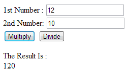

# JavaScript Tools

## 1 Editing and Testing JavaScript Code

In the sidebar open the files  `calculations.html` and `calculations.js`. You can now make changes to the code. To preview the page (and run your program) you need to view it in a new tab in your web browser. 
At the top of the screen you should see a menu item called *Preview*.

Make sure the html code is open then click *Preview* and choose *Live preview file*.
This will open your web page in a new browser tab as shown.

### TODO: 1 Test Your Understanding
- Write a JavaScript program to calculate multiplication and division of two numbers (input from user). 
- Define a form like this

- validate that user input is numbers, before you call divideBy or multiplyBy function. 
- check also that you don't divide by zero
- show the result on the page

As you edit the file in C9 you have to save once in a while. To view the new version simply refresh the web browser tab running your web page. Often it is convenient to disable Chrome cache, open DevTools in Chrome and click Network in the toolbar to open the network pane.
Check the Disable cache checkbox at the top.

### JavaScript source material

To help you get acquainted with the syntax used in JavaScript, use a tutorial such as [W3Schools JavaScript tutorial](http://www.w3schools.com/js/). You will learn that several JavaScript constructs, such as the control structures are very similar to Java.

## 2 Chrome Developer Tools
Get familiar with the Chrome Developer Tools. They are your friends when you have problems in your code.

### 2.1 Console Output

Load up `guess.html` and run it in a new browser tab.

“Nothing” happens. . . Actually, the result is being logged to the console which is a part of the Chrome Developer Tools integrated in to the browser.

1. From the customize and control menu in Chrome (3 horizontal bars), choose More tools > Developer tools (ctrl-shift-I on a Chromebook) to open the Developer Tools pane. 
2. This can be docked to the right or bottom of the main window (bottom preferable).
3. Click on the console tab and try submitting the form again (you can ignore errors at this point) to see output
4. Code is missing the call of init function, you must define that init function is called when the form is submitted.

### TODO 2 Test Your Understanding

- Load up `guess.html` and `guess.js`

- Write the `init` function to set up an event listener on the form. The event listener should pass the value of the input element to the `check` function.

- Write the `check` function to accept a value from the event listener and check it against the `targetNumber`. 

  - If the values match, call the `showWin` function
  - If the values do not match, call the `showError` function. 
  - If the values do not match, and the player has made more than five guesses, call the `showLoss` function. 
  
- Write the `showWin` function to  show a message on the console telling the player they win.

- Write the `showError` function to show a message on the console telling the player their guess is incorrect.

- Write the `showLoss` function to show a message on the console telling the player they lose.

## 3 ESLint Code Checking

Writing clean, readable, and error-free high-quality code is essential to maintainability. 
Therefore most languages now have automated syntax and style “checkers” called linters that code editors and IDEs can use to alert potential problems to programmers immediately, when they are writing their code.

ESLint is completely configurable through a configuration file .eslintrc which is located in the 01 Javascript Tools directory. 
By default any file or directory starting with the period (.) character is hidden. 
To display hidden files and directories click on the gear icon at the top of the Documents Tree and choose Show Hidden Files.

1. the env object imports groups of pre-defined global variables based on the environment they are used in. 
2. the rules object defines any additional rules we want to enforce.
In this example we are specifying that we don't want semicolons at the end of each line, 
that we will use a 2 space tab for indenting, we will use single quotes for strings and that we are using UNIX line endings.

### 3.1 Enabling ESLint

To enable ESLint you need to copy configuration file .eslintrc to the workspace  ~/workspace directory. 
You can configure eslint, look at [configuring](http://eslint.org/docs/user-guide/configuring).

Note that many of the highlighted issues are about things like indentation, and consistency of style, as well as syntax. That is because linters take readable code very seriously, 
and so should you! You should aim to have no ESLint warnings when you write your JavaScript or other programming code.

## 4 Strict Mode

JavaScript’s strict mode allows you to use a safer, restricted version of the language. 
It makes changes to the semantics to help you avoid many common errors. 
For example if you don’t use the var keyword when declaring variables these become globally scoped. With strict mode enabled these get flagged up as errors.

To enable strict mode you simply add a line of code.

`"use strict";`

This can be added to the top of your script if you want it to apply to everything, alternatively it can be implemented only within certain blocks of code by adding it there instead.

With strict mode enabled your program will throw errors which can be seen in the browser console.

- Identify any errors flagged up in the editor
- Attempt to fix these errors so your program runs.

## 5 Basic Debugging

For a much more detailed description read [Google’s debugging JavaScript guide](https://developer.chrome.com/devtools/docs/javascript-debugging).

Sometimes your attempts to change the code will introduce bugs. A bug is usually signalled by some kind of error message, usually RED in colour, appearing on the console. 
If you find a bug has appeared in your code do the following to help track it down:

1. Note the line number that caused the problem, if any is mentioned on the console output (sometimes it is not)
2. Load the ‘Sources’ tab in the developer tools area and select the JS file
3. Click in the margin next to any line number to add a code break (add it near but before the suspect line); you can add several if you wish
4. Now refresh the page and proceed as normal until the code execution stops at the line break you created
5. On the information tab on the right hand side you will see details about the call stack and currently scoped variables to help you pinpoint the state of your program
6. Use the “Step over / into / out of” buttons to execute your JS line by line and keep an eye on the stack and scope to catch anything unexpected

### 5.1 Debugger

Lets get familiar with the debugger:

1. Click on the Sources tab and open the any js file
2. Click in the margin to add a breakpoint.
3. Refresh the browser, execution will pause at the breakpoint.
4. Click on the Step into next function call button (down arrow with dot). This will run the line and move execution to next line. Click this button to execute the code line by line.
5. Observe the variables changing in the right-hand panel.

### TODO 3 Test Your Understanding

Use the debugger to help fix a problem with your program:

- Modify the `showWin` function to remove the form and any error message, and show a message telling the player they win.
- Modify the `showError` function to show a message telling the player their guess is incorrect.
- Modify the `showLoss` function to remove the form and show a message telling the player they lose.

