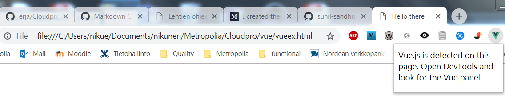
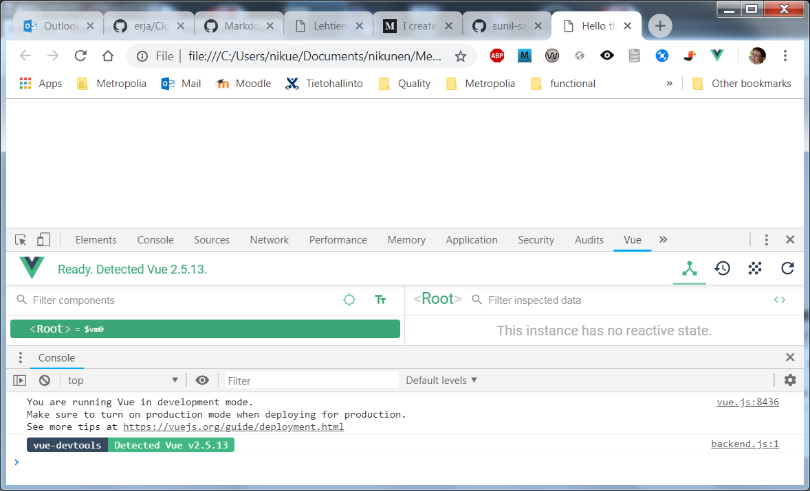
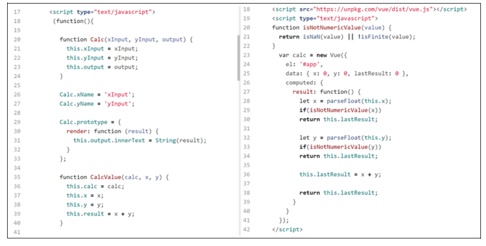
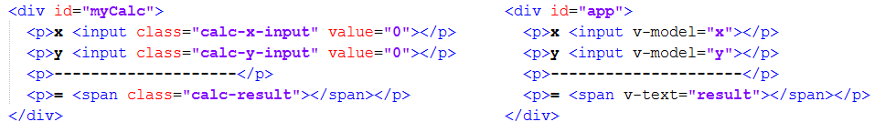

## Vue

This worksheet will introduce you to a framework which will allow you to create interactive JavaScript apps that run in the web browser. You will be using these skills to create an interactive client that makes use of your API.

VueJS is a client-side JavaScript framework developer by Evan You. It supports a number of features:

- two-way data-binding
- A refinement of MVC, the Model–View–ViewModel
(MVVM) pattern which introduces the view-model, and its data bindings (collectively,
the binder).
- form validation
- directives: allow you to define new html syntax and create re-usable components

### 1.1 Viewing a VueJS page

The core Vue team has developed a Chrome extension—vue-devtools—that’s tailored
to the task of inspecting Vue applications at runtime.
You can install the vue-devtools extension from the Chrome Web Store by visiting
http://mng.bz/RpuC.

`POST-INSTALLATION NOTE` If you open the Developer Tools pane and don’t see a
Vue tab after you installed the extension, try opening a new tab or window
before restarting Chrome.

After you’ve installed the extension, you need to enable it for use on local files. In Chrome, select
Window > Extensions, then locate the Vue.js devtools entry. Tick the Allow access to
file URLs check box and you’re all set, as seen in the following figures 



and




There is a valid Vue file `vueex.html` in the directory you can use it as a guineapig.

Assuming you are using Cloud 9 as your IDE there are a number of ways to run an VueJS app. You should try each approach.

1. The simplest way is to right-click on the `vueex.html` file and choose _preview_. This will open a new tab in Cloud9 and run the page. The downside of this is that you will not have access to the debugger or the console.
2. A better way is to launch the built-in Apache web server which will allow you to access the page in a new tab in the Chrome Browser. This will give you access to the full suite of developer tools. Open the `vueex.html` file then open dev tools and you should see the Vue tab.

## 2 Understanding a Vue application

Open both `calculator.html` and `calculatorvue.html` files. The first one is a simple plain Javascipt version 
of a calculator for adding to numbers. The second one is a Vue version of the same. Both of these have the HTML and the Javascipt inside one file, later we have examples of how to use separate files for Vue.

Open developer tools for both files, in Vue version you should see the Vue tab. Test both to see what happens.
Look at source files and notice the differences in Javascipt



and in HTML



The key difference between the two applications is how an update to the final calculation
is triggered and how the result finds its way back to the page. In our Vue example,
a single binding v-model takes care of all the updates and calculations on the page.
When we instantiate our application with new Vue({ ... }), Vue examines our Java-
Script code and HTML markup, then creates all the data and event bindings needed
for our application to run.

### TODO 1 Test your understanding

1. `calculatorvue.html` uses Vue's v-model directive. Use this as an example and make a file `ui.html`,
which basically has this data.
```
 <div id="app">
    <p>x <input v-model="x"></p>
    <p>y <input v-model="y"></p>
    <p>---------------------</p>
    <p>= <span v-text="result"></span></p>
  </div>
```
2. In week 1 set 1 you had a calculator with buttons
```
<input type="button" onClick="multiplyBy()" Value="Multiply" />
<input type="button" onClick="divideBy()" Value="Divide" />
```
Add these buttons to your in HTML file, but vuelize them.
3. Make another file logic.js where you put your Javascript for multiplying and dividing numbers. 
4. Make this modular application to work and check it out with developer tools.

## 3 Local Storage

Local Storage is part of the HTML5 [Web Storage API](https://developer.mozilla.org/en-US/docs/Web/API/Web_Storage_API/Using_the_Web_Storage_API) specification and not a feature of VueJS however it is particularly useful when developing single-page applications. It allows the app to persist a limited amount of data, typically 5MB. The API includes two stores, LocalStorage, used to store data indefinitely and SessionStorage which persists the data until the browser is closed. Both of these work in a similar manner however in this exercise we will be using LocalStorage.

Open next the `todoMVC_Vue.js`in the todo folder. Notice how we have split our application in more than one file. Our application uses localstorage and the functions
`localStorage.setItem()` for setting data and `localStorage.getItem()` for retrieving data.
Localstorage holds key-value pairs, you can store only strings as values. If you want to store something
more complex, you have to use the JSON.stringify() method before passing to setItem():
```
const person = {
    name: "Obaseki Nosa",
    location: "Lagos",
}
localStorage.setItem('user', JSON.stringify(person));
```
To retrieve the user key stored above, use `getitem()`:
```
localStorage.getItem('user');
```
and you get
```
"{"name”:"Obaseki Nosa","location":"Lagos"}"
```
To use this value, you have convert it back to an object. To do this, make use of JSON.parse() method which converts a JSON string into a Javascript Object.
```
JSON.parse(window.localStorage.getItem('user'));
```

### TODO 2 Test Your Knowledge

At present the calculations in our little calculator are not stored

1. Modify the calculator to store calculations in `localStorage` object.
2. Figure out the format to store the number1, number2 and result.
3. Retrieve this additional data and display it.
