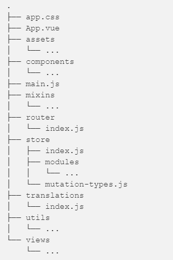

# VueJS Routing

Now you have mastered the concepts of binding and directives we can learn about how VueJS can be used to develop complex [single-page applications](https://en.wikipedia.org/wiki/Single-page_application) (SPA). A single-page application behaves like a desktop app where content is dynamically loaded as needed without the entire page being downloaded and replaced. You will have already experienced SPAs through tools such as _Google Drive_ and _Outlook_.


## 1 Routing

Open the `Routing_ex.html` file.

1. this needs both the standard `vue.js` file and the `vue-router.js` files.
  - the second file is required to support the development of SPAs
  - both files are hosted locally.
2. the page includes links to two _routes_, **Route1** and **Route2**
 
3. the `<router-view></router-view>` indicates where the dynamic content will be displayed.
4. The constant `routes` connects the paths and templates together.

### TODO 1 Test Your Knowledge

1. create a new constant called **NotFound** with template
```
{ template: '<div>The page is not found</div>' }
```
2. if the user tries a not valid route, show the message telling that page is not found.

## 2 vue CLI

When your application start growing, it is a good idea to install Vue CLI and use it for project creation. To install the Vue CLI:
```
npm install -g @vue/cli
```

After installation, you will have access to the vue binary in your command line. You can verify that it is properly installed by simply running vue, which should present you with a help message listing all available commands. You can check you have the right version (3.x) with this command:
```
vue --version
```


Creating a project with the command:
```
vue create app
```
or use the graphical interface:
```
vue ui
```
you get a clean structure for your application



### TODO 2 Test Your Knowledge
1. First install Vue CLI.
2. Make a project for Vue-based chat. Later you can try to expand this to use your own Nodejs REST API for chat messages.
3. At the moment you can you use for example Localstorage for storing chat messages.


