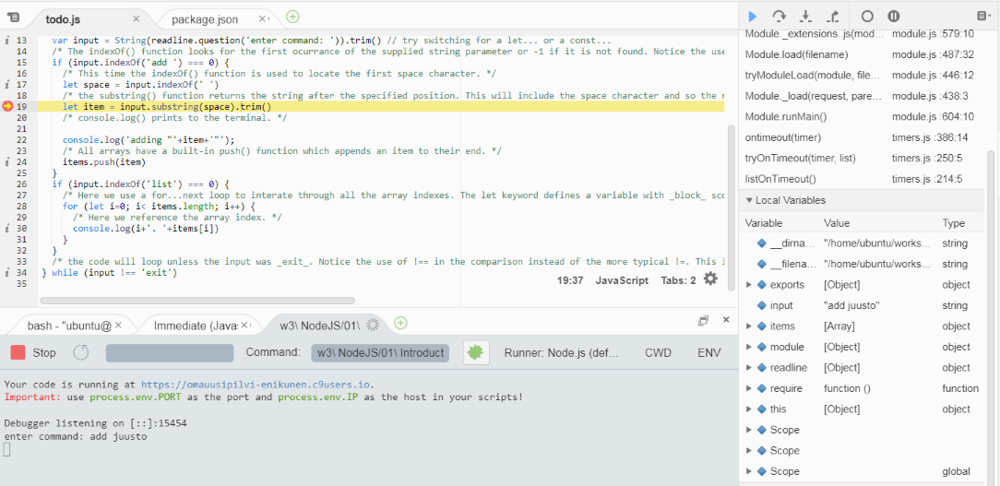

## 1 Variables and Scope

In the following examples we will be using a _node module_ to capture user input.

Load up the `todo.js` script and read through it to understand how it works. There are lots of code comments to assist you.

Before you can run the script you need to install the _module dependencies_. These are listed in the `package.json` file. This is formatted as a `json` document, you will learn mre about this in a later topic. Open this up and look for the `dependences` array, it specifies that we need to install the `readline-sync` module. To install this you need to use the _terminal_ to navigate to the directory then run `npm install`. Notice that you now have a new directory called `node_modules/`.

Return to the `todo.js` script and run it by clicking on the **Run** button in the top toolbar. Once running you can use the `add` command to add new items to the list and the `list` command to print out the list items. The final command will terminate the application.
```
node index.js
add cheese
add bread
add butter
list
exit
```

### 1.1 Variables and Constants

There are three ways to declare a variable in the latest version of JavaScript (ECMA6). Node already supports many ECMA6 features, there is a full [list](https://nodejs.org/en/docs/es6/) available so you know what is supported.

1. Standard variables are _function scoped_ which means they are available anywhere within the function in which they are declared. These are declared with the `var` keyword.
2. Immutable variables (constants) are block scoped. These are declared using the `const` keyword.
3. Finally, any variable declared with the `let` keyword is _block scoped_. This means the variable is only visible within its block (defined by curly braces).

### TODO 1 Test Your Knowledge

1. locate the `input` variable declaration (just inside the `do` loop)
  - substitute it for a constant by replacing the `var` with `const`, what effect does this have.
  - now substitute a block-scoped variable by substituting `const` for `let`, what effect does this have?
2. the array at the top of the script is defined using `var`. What happens if you make this immutable (use `const`)?
3. Items are added to the array using its `push()` method.
  - substitute `push()` for the [unshift](https://developer.mozilla.org/en-US/docs/Web/JavaScript/Reference/Global_Objects/Array/unshift) method. How does this change the script?

## 2 Linting

JavaScript is a powerful language and includes a number of powerful features but it also includes features that, whilst they may produce working code, will make your code difficult to read and debug! A **linter** is a program that analyses your scripts for _programmatic_ and _stylistic_ errors and will flag up anything that may cause problems. They define a _professional subset_ of the language and reject any code that doesn't meet that standard.

There are a number of _linters_ available for the JavaScript language. The original one was written by Douglas Crockford (the author of JavaScript: The Good Parts). This enforced _his_ idea  of good JavaScript and was notorously not configurable! There are now a number of popular linters available, your choice should be based on what will run in your IDE as well as your personal preferences. The most popular linters are:

1. [JSLint](http://www.jslint.com/help.html), the original, by Douglas Crockford
2. [JSHint](http://jshint.com/docs/)
3. [ESLint](http://eslint.org) which is supported by _Cloud 9_

### 2.1 Linter Configuration

ESLint is completely configurable through a configuration file `.eslintrc` which is located in the `w3 NodeJS/01 Introduction` directory. By default any file or directory starting with the period (.) character is hidden. To display hidden files and directories click on the **gear icon** at the top of the _Documents Tree_ and choose _Show Hidden Files_.

1. the **env** object imports groups of pre-defined global variables based on the _environment_ they are used in. In our example we will be writing scripts using the NodeJS environment so we want the linter to recognise any NodeJS global variables.
2. the **rules** object defines any additional rules we want to enforce. In this example we are specifying that we _don't want semicolons_ at the end of each line, that we will use a 2 space tab for indenting, we will use single quotes for strings and that we are using UNIX line endings.

### TODO 2 Test Your Knowledge

Open the `membership.js` file. Run the script, it works correctly.

Notice the _red error circles_ and _yellow warning triangles_ in the left margin. If you hover the mouse pointer over these you can find out more. These

1. locate any _errors_ in the script and fix
2. locate the _warnings_ and fix the code to remove these

## 3 Cloud9 Debugger

The **Cloud9** IDE includes a powerful debugger. Lets test how this works. You should then make use of it when attempting the *Test Your Knowledge* tasks.

Stop the script (todo.js) using `ctrl+C` and restart it. By stopping and restarting the script it will have lost the list items you typed in previously.

1. add the cheese item to the list (see above)
2. add a breakpoint to the code just inside the callback by clicking in the left margin next to `let item = input.substring(space).trim()`. 
Breakpoints are indicated by red circles.
3. add the *bread* item. Notice that the program execution stops on `let item = input.substring(space).trim()` without executing it.
4. notice all the script's variables are listed as *undefined* in the right-hand pane.
5. The local text variable should now contain the string you typed in. Locate this in the *local variables* pane. Now hover your mouse pointer over the variable name.
6. practice using the debugger buttons *Resume*, *Step Into*, *step out* until you understand their function.
7. In the **Watch Expressions** pane type in `itemss` and press enter. You can now see the contents of the array change as the program executes. You can of course also hover over the variable name in the code...



You can read more about Cloud9 debugger capabilities in their [online documentation](https://docs.c9.io/docs/running-and-debugging-code). You should take time to get familiar with its capabilities.

### TODO 3 Test Your Knowledge

1. modify the code to prevent duplicate items being added. You will need to use the [`Array.indexOf()`](https://developer.mozilla.org/en/docs/Web/JavaScript/Reference/Global_Objects/Array/indexOf) method.
2. create a **remove** option so an item such as *cheese* can be removed using the syntax `remove cheese`. You may need to use the [`Array.splice()`](https://developer.mozilla.org/en/docs/Web/JavaScript/Reference/Global_Objects/Array/splice) method.
3. The current version is case sensitive. Modify the code so that items are converted to lowercase before being added or searched for. You will need to use the [`String.toLowerCase()`](https://developer.mozilla.org/en/docs/Web/JavaScript/Reference/Global_Objects/String/toLowerCase) method.

